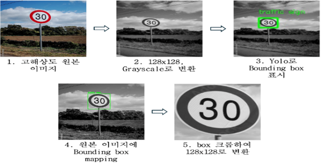
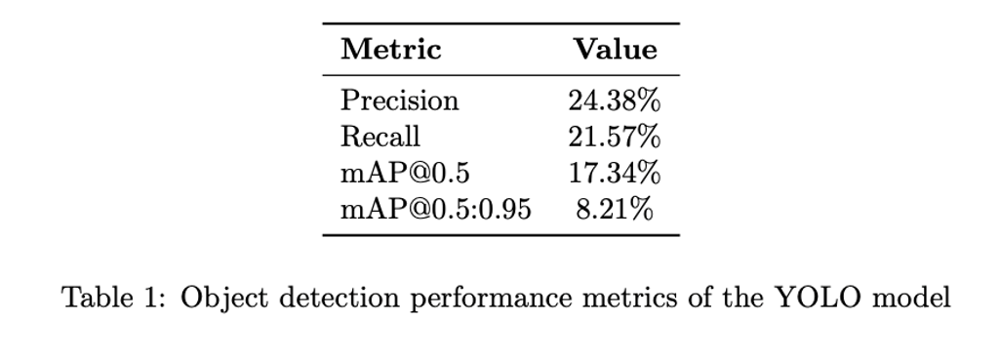
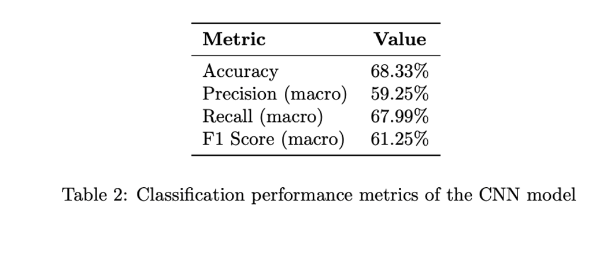
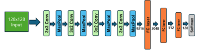

# Speed Sign Detection System (YOLOv5 + CNN + TFLite)

End-to-end speed sign recognition pipeline:
1. Detect speed signs using a YOLOv5 grayscale model
2. Crop and preprocess the detection
3. Classify cropped sign using a lightweight CNN (TensorFlow Lite)

---

## 📁 Project Structure

```
project_root/
├── run.py                       # Runs YOLOv5 detection and crops highest-confidence result
├── detect_image_utils.py        # (optional) Contains reusable detect_image() logic
├── 128_128.pt                   # YOLOv5 grayscale model (128x128)
├── image1.jpg                   # Sample input image
├── result_image.jpg             # YOLOv5 result with bounding boxes
├── cropped_result.jpg           # Cropped ROI for CNN input
├── speed_sign_model.h5          # Trained CNN model (Keras)
├── speed_sign_model.tflite      # Quantized TFLite model (optional)
├── train_speed_sign_cnn.py      # CNN training script using grayscale images
├── changing_yaml_to_gray.ipynb  # Notebook for YOLO grayscale config + training
├── /home/hyunoh/train/          # Folder of labeled training images by class
│   ├── Maximum_Speed_30/
│   ├── Maximum_Speed_40/
│   └── ...
└── README.md                    # ← this file
```

---

## 🔍 Step Overview

### 1. Train YOLOv5 (Grayscale, 128x128)
- Train YOLOv5 with custom data using `changing_yaml_to_gray.ipynb`
- Output model: `128_128.pt`

### 2. Run Detection
```bash
python run.py
```
- Loads `image1.jpg`
- Runs YOLOv5
- Saves:
  - `result_image.jpg` (with bounding box)
  - `cropped_result.jpg` (for CNN input)

### 3. Train CNN Classifier
```bash
python train_speed_sign_cnn.py
```
- Trains CNN using grayscale cropped images (7 classes)
- Saves model as `speed_sign_model.h5`

### 4. (Optional) Convert to TFLite
```python
import tensorflow as tf
model = tf.keras.models.load_model("speed_sign_model.h5")
converter = tf.lite.TFLiteConverter.from_keras_model(model)
tflite_model = converter.convert()
with open("speed_sign_model.tflite", "wb") as f:
    f.write(tflite_model)
```

---

## 🛠 Requirements

```bash
pip install torch torchvision opencv-python tensorflow scikit-learn
```

---
---

## 🧠 Full Pipeline Overview

The overall process of hybrid detection is shown below:



> The pipeline includes grayscale preprocessing, YOLOv5 detection, bounding box mapping, and CNN classification using cropped images.

---

## 📈 YOLOv5 Detection Performance

YOLOv5 was trained on custom grayscale images at 128x128 resolution.



> Precision: 24.38%, Recall: 21.57%, mAP@0.5: 17.34%, mAP@0.5:0.95: 8.21%

---

## 🔍 CNN Classification Performance

The CNN classifier was applied to cropped sign images.



> Accuracy: 68.33%, Precision (macro): 59.25%, Recall (macro): 67.99%, F1 Score: 61.25%

---

## 🧬 Custom CNN Architecture

The structure of the CNN model used for sign classification:



---


## 🎯 Goals

- Fast and lightweight speed sign recognition system for embedded devices (e.g., Raspberry Pi)
- YOLOv5 + CNN architecture
- Optimized input size: 128×128 grayscale

---

## 🚦 Future Expansion – Multi-object Detection

In order to enhance real-world applicability, we began extending the detection model to include objects such as traffic lights, pedestrians, and vehicles.

> YOLOv5 was reconfigured to support multiple classes, and relevant datasets were explored and partially integrated. This sets the foundation for transitioning the system from a single-task speed sign detector to a generalized road environment detector.

---

## 📌 Notes

- `run.py` avoids `detect.py` and gives full control over detection and post-processing
- CNN model is trained separately using speed sign class folders


